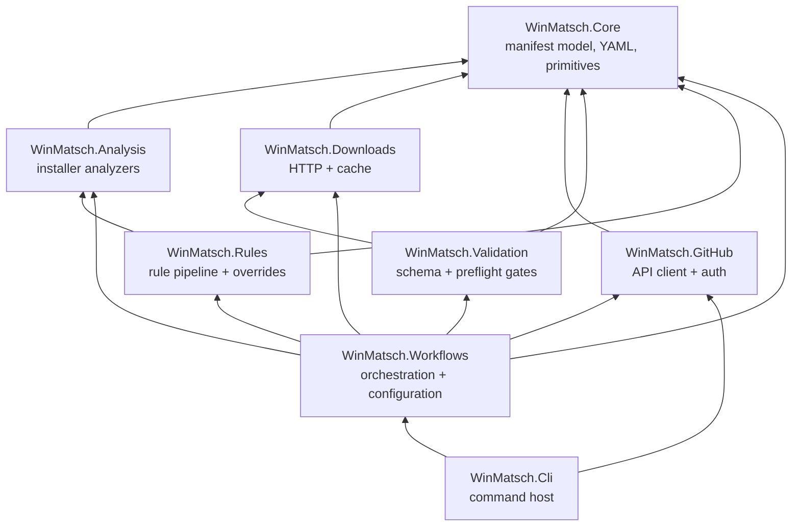

# Architecture

## Project graph

Eight production projects, plus one shared test-infrastructure project, with a
strict, acyclic dependency direction — foundations never depend on orchestration:

| Project | Responsibility |
|---|---|
| `WinMatsch.Core` | Manifest object model, YAML serialization, enums, primitives. No I/O. |
| `WinMatsch.Analysis` | Static installer analyzers (MSI, MSIX, ZIP, PE, Burn, NSIS, Inno, Advanced Installer, Squirrel) and analysis limits. |
| `WinMatsch.Downloads` | HTTP downloads, persistent cache with integrity, locking, freshness. |
| `WinMatsch.GitHub` | GitHub REST client, token resolution, OS keyring stores. |
| `WinMatsch.Validation` | Manifest-schema validation (embedded WinGet 1.12.0 schemas) and preflight gates. |
| `WinMatsch.Rules` | Rule pipeline, rule catalogue, override packs, quirks, sanitization, human-correction detection. |
| `WinMatsch.Workflows` | End-to-end workflows (discover → download → analyze → generate → rules → validate → submit), configuration resolution. |
| `WinMatsch.Cli` | `winmatsch` executable: command tree, hosting, interaction, output contract. |
| `tests/WinMatsch.Testing` | Shared test infrastructure: synthetic fixtures, HTTP recordings, fakes. |

Everything is trim- and AOT-analyzable (`IsAotCompatible`), warnings are
errors, and trim-analysis warnings (`IL2026`, `IL3050`, …) are errors in the
executable-facing projects.

## Workflow stages and evidence trust

Mutation workflows run a fixed pipeline:

1. **Discover** — resolve the target version and installer URLs (release
   metadata, explicit `--urls`, or override pack).
2. **Download** — fetch installers through the caching pipeline; verify
   hashes; detect changed bytes behind stable URLs.
3. **Analyze** — extract evidence from installer binaries
   ([analyzer guide](analyzers.md)).
4. **Generate** — build the multi-file manifest set from the previous
   version plus evidence.
5. **Rules** — run the deterministic rule pipeline
   ([rules guide](rules.md)); mutating rules precede validation rules by
   construction.
6. **Validate** — schema and preflight validation
   (`WinMatsch.Validation`).
7. **Submit** (opt-in) — fork → branch → commit → pull request, with
   duplicate-PR preflight, provenance tracking, and partial-state reporting.

### Verified apply and submission recovery

Every `LocalOperationPlan` has a canonical SHA-256 fingerprint. Its
length-prefixed encoding distinguishes null from empty values and covers
operation identity, exact before/after/change bytes and expected old hashes,
rules and reviews, validation policy, mapping/configuration inputs, installer
evidence, release provenance, replacement semantics, and learned-override
state. The presentation-only `CREATED_AT` audit timestamp is excluded.

Apply callers do not pass a plan object back to the engine.
`ApplyVerifiedPlanAsync` acquires the external local package lock, rebuilds the
plan and final preflight from current inputs, checks the expected fingerprint
and review binding, and only then enters the manifest transaction. Drift
returns `StalePlan` or `Conflict` without writes.

For `--submit`, the CLI prepares a secret-free intent before local apply. After
the manifest transaction, provenance capture, and learned-override activation
have completed, exact local bytes promote that intent to a durable submission
journal outside the repository. The journal records CAS revisions and branch,
commit, and pull-request boundaries. Each remote mutation is first marked
uncertain, so a crash never causes automatic retry of an unknown outcome.
Recovery rematerializes the request only from verified local bytes, pinned
upstream bytes, artifact identities, and journaled presentation/idempotency
fields. A verified PR removes the journal; conflicts and escalation retain it.

The lock order is:

1. local verified-plan package lock;
2. learned-override recovery lease;
3. manifest transaction/recovery lock;
4. release local locks before crossing to remote work;
5. submission-journal CAS lock;
6. GitHub per-package remote lock.

No path acquires an earlier lock while holding a later one. Local and override
transactions finish before journal promotion, and journal file locks are
released before GitHub calls.

Evidence is trusted in tiers: values proven by installer analysis rank above
values inferred from downloads, which rank above defaults; human corrections
detected in the merged upstream manifest outrank all regeneration and force
review instead of being overwritten.

## Durable journals

Three independent journal families make interrupted work recoverable. They are
separate on purpose: each one is retired only when the state it guards is
provably final, and none of them can silently complete work another one owns.

| Family | Guards | Lives in | Statuses |
|---|---|---|---|
| Local manifest / provenance transaction | staged manifest writes and provenance capture in the repository checkout | `.winmatsch-transaction-*` next to the target, inside the repository | `prepared` → `manifests-committed` → `committed` |
| Learned override store | an approved human correction on its way to becoming a learned override pack | the override store (`--override-store`, default `winmatsch/overrides` under local application data) | `prepared` → `manifest-committed` → `activated` |
| Local-to-remote submission | the fork → branch → commit → pull-request sequence | the submission-journal directory outside the repository | `Pending`, `BranchCreated`, `CommitCreated`, `PullRequestCreated`, `EscalationRequired`, `Cancelled` |

The first two recover automatically on the next Apply-mode run for the same
package — plan runs (`--dry-run`) never write, so they leave pending state
untouched; the learned-override journal is described under
[learned corrections](rules.md#learned-corrections-approved-once-reapplied-later).
Pending submission journals are listed by `winmatsch submissions`, which reports
each entry's CAS revision, lifecycle state, pull-request number when known, and
whether the last remote outcome is uncertain.

### Local writes, transactions, and recovery journals

Manifest writes to a local repository checkout are transactional, not
file-by-file. Each mutating run:

1. creates a scratch directory next to the target,
   `.winmatsch-transaction-<key hash>-<token>`, where `<key hash>` derives
   from the operation lock key — the **package identifier**, so all versions
   of one package share a lock and a transaction prefix;
2. stages every planned change there and writes a **journal** file recording
   the transaction status (`prepared` → `manifests-committed` → `committed`)
   plus one line per change (kind, whether a destination file already existed,
   and the base64-encoded repository path). The journal is flushed to disk
   (`FileOptions.WriteThrough` + `Flush(flushToDisk: true)`) and renamed into
   place, so it is never observed half-written;
3. applies the changes, then deletes the transaction directory.

If the process is killed mid-write, the directory survives. The next
**Apply-mode** run for the same package — any version of it — against that
repository root recovers it first: under the repository operation lock, before
staging anything new, in deterministic ordinal order. Plan runs (`--dry-run`)
never recover, because they never write. The transaction prefix embeds the
package identifier, so recovery never touches another package's in-flight work.

| Journal status | Recovery |
|---|---|
| missing | Nothing was journaled, so no destination was ever changed; the directory and anything staged inside it are deleted. |
| `manifests-committed` | Rolled **forward**: manifests are already on disk, so provenance capture is completed from the journal's committed paths. |
| `committed` | Nothing to do; the directory is removed. |
| `prepared`, or any other value | Treated as uncommitted and rolled **back**: staged changes are undone in reverse order, restoring or removing each destination. |

Recovery never guesses at a damaged journal: an entry whose structure or
change-kind cannot be parsed fails with `InvalidDataException`, and corrupt
base64 path data surfaces as a `FormatException`. Either way the run stops
rather than replaying a half-understood journal. The directories are hidden
(`.`-prefixed) and never contain secrets. Deleting one by hand is safe only
when you accept losing whatever it staged; on doubt let the next apply run
recover it.

## Extending

### Adding an analyzer

1. Implement the analysis in a new folder under `src/WinMatsch.Analysis/`
   (for EXE variants, implement the format probe interface used by
   `ExeAnalyzer`; for new containers, extend `FileAnalyzer` dispatch).
2. Route all archive/stream reads through `AnalysisLimits` so bounds apply.
3. Add synthetic fixtures (see [fixture policy](#fixture-policy)) and unit
   tests under `tests/WinMatsch.Analysis.Tests`.

### Adding a rule

1. Reserve an ID: `WM00xx` normalization, `WM01xx` validation, `WM02xx`
   quirk, or a policy prefix (`ARP-`, `SCOPE-`, `META-`, `DEP-`, `PIPE-`).
2. Implement `IRule` under `src/WinMatsch.Rules/Rules/` (policy rules in
   `Rules/Policy/`). Rules must be deterministic, mutate only fields they
   own, and attach change evidence for non-obvious values.
3. Register it in `ProductionRuleComposer` at the right pipeline position —
   mutating rules must precede validation rules; the pipeline asserts this.
4. Add tests in `tests/WinMatsch.Rules.Tests`, including log-only behavior.
5. Document it in [docs/rules.md](rules.md).

### Adding a command

1. Create a module implementing `ICommandModule` under
   `src/WinMatsch.Cli/Commands/`.
2. Respect the hosting contracts: results to stdout via `ICommandOutput`
   (text and JSON), diagnostics to stderr, exit codes from `ExitCodes`,
   prompting via `IUserInteraction` only.
3. Register it in the CLI composition and cover it in
   `tests/WinMatsch.Cli.Tests` (help shape, JSON contract, non-interactive
   behavior).

## Fixture policy

Test fixtures are **synthetic**: JSON descriptors, recorded HTTP
interactions, and generated bytes. Real third-party installer binaries are
never committed — for licensing reasons and repository hygiene. Regression
descriptors can optionally re-acquire live artifacts locally via the opt-in
`WINMATSCH_E2E_ACQUIRE_FIXTURES=1` flow; acquired binaries stay out of the
repository.

## Clean-room licensing

The installer-format analyzers were implemented from public format
documentation and observation of file structures — not by porting existing
parsers. Do not copy source from third-party installers/tools into this
repository; add any new runtime dependency to
[THIRD-PARTY-NOTICES.txt](../THIRD-PARTY-NOTICES.txt) with verified license,
source, and version.

## Testing model

| Layer | Location | Character |
|---|---|---|
| Unit/component | `tests/<Project>.Tests` | Hermetic, fast, per-project. |
| Shared infrastructure | `tests/WinMatsch.Testing` (+ its own tests) | Fixture catalogue, fakes, recordings. |
| End-to-end | `tests/WinMatsch.E2E.Tests` | Runs the real executable as a process; hermetic by default (no network, token cleared, `NO_COLOR` forced); asserts safety contracts (no secrets, no stack traces, no ANSI in captured output). |

Opt-in live E2E (excluded from CI):

| Variable | Effect |
|---|---|
| `WINMATSCH_E2E_TEST_REPOSITORY` + `WINMATSCH_E2E_GITHUB_TOKEN` | Enables read-only live GitHub tests against the named repository. |
| `WINMATSCH_E2E_LIVE_MUTATION=1` + `WINMATSCH_E2E_LIVE_REPOSITORY` + `WINMATSCH_E2E_GITHUB_TOKEN` | Enables live mutation tests. The test asserts the repository is exactly `b0t-at/winmatsch-e2e` — a hard allowlist; mutations against any other repository refuse to run. |
| `WINMATSCH_E2E_ACQUIRE_FIXTURES=1` | Enables fixture acquisition flows. |

## Local development

See [CONTRIBUTING.md](../CONTRIBUTING.md) for setup, build/test/format
commands, and PR expectations.
